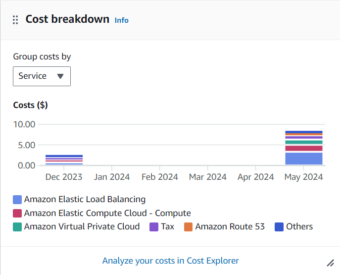

# projeto-cloud

## Pedro Drumond

## Sobre o Projeto
O projeto é uma implementação de uma infraestrutura na AWS utilizando os serviços de VPC, subnets, Auto Scaling com instâncias EC2, Application Load Balancer (ALB), DynamoDB e endpoints de VPC. O objetivo foi criar uma arquitetura que fosse escalável e segura para aplicar uma aplicação.

## Visão Geral da Arquitetura do Projeto
A arquitetura proposta consiste em uma Virtual Private Cloud (VPC) que pode hospedar subnets públicas e privadas, configuradas para suportar instâncias EC2 que são escaladas automaticamente com base na demanda. Um Application Load Balancer (ALB) distribui o tráfego de entrada entre as instâncias EC2 para garantir alta disponibilidade e escalabilidade. Um banco de dados DynamoDB é utilizado para armazenamento de dados, proporcionando alta performance e escalabilidade automática. Para melhorar a segurança e a eficiência, um endpoint VPC é configurado para acesso ao DynamoDB sem a necessidade de saída pela internet.

Link da imagem: https://avinetworks.com/glossary/elastic-load-balancer/

## Sobre as tectologias que foram empregadas para o projeto

A Amazon Web Services (AWS) é uma plataforma de computação em nuvem oferecida pela Amazon, composta por diversos serviços distribuídos em várias regiões geográficas ao redor do mundo. O AWS Command Line Interface (AWS CLI) é uma ferramenta unificada que permite gerenciar os serviços da AWS através de comandos de linha de comando, facilitando a automação de tarefas. O Amazon Elastic Compute Cloud (Amazon EC2) oferece capacidade de computação redimensionável na nuvem, permitindo a execução de aplicativos em servidores virtuais (instâncias EC2) com alta escalabilidade e flexibilidade.

O Application Load Balancer (ALB) é um balanceador de carga gerenciado para aplicativos HTTP e HTTPS, operando na camada 7 do modelo OSI. Ele distribui o tráfego de entrada com base em regras definidas pelo usuário e oferece recursos como "Health Checks" e escalabilidade automática. O Auto Scaling Group (ASG) gerencia um grupo de instâncias EC2 como uma única unidade para dimensionamento automático, ajustando a capacidade conforme a demanda para garantir disponibilidade e otimizar custos.

O Amazon CloudWatch é um serviço de monitoramento e observabilidade que coleta e rastreia métricas, monitora logs e define alarmes. No projeto, ele monitora o status do ASG e das instâncias EC2, criando novas instâncias automaticamente quando o uso da CPU ultrapassa 70%. O Amazon DynamoDB é um serviço de banco de dados NoSQL totalmente gerenciado, oferecendo desempenho rápido e previsível com escalabilidade contínua, sem a necessidade de gerenciar servidores. O AWS Identity and Access Management (IAM) ajuda a controlar o acesso a recursos da AWS, permitindo gerenciar usuários, grupos e permissões para conceder ou negar acesso a recursos específicos.

O Amazon Virtual Private Cloud (Amazon VPC) permite a criação de uma rede virtual na AWS, controlando a seleção de endereços IP, criação de sub-redes e configuração de tabelas de roteamento e gateways de rede.

## Passo a Passo

### Antes de começar
Verifique se seu AWS CLI está instalado, se não estiver, basta segui a documentação do site: https://docs.aws.amazon.com/cli/latest/userguide/getting-started-install.html

Tendo o AWS CLI instalado, você precisa configurá-lo com suas credenciais através do comando:

'''sh
aws configure
'''

### Criar
aws cloudformation create-stack --stack-name jameStack --template-body file://projeto.yaml --capabilities CAPABILITY_IAM --region sa-east-1

### Update
aws cloudformation update-stack --stack-name jameStack --template-body file://projeto.yaml --capabilities CAPABILITY_IAM --region sa-east-1

### Delete
aws cloudformation delete-stack --stack-name jameStack --region sa-east-1

## Região
A escolha da região sa-east-1 (São Paulo) para a implementação da infraestrutura na AWS foi feita para garantir uma baixa latência e melhor performance para usuários na América Latina, especialmente no Brasil. Esta proximidade geográfica é crucial para aplicações que exigem respostas rápidas, como criação de usuários, melhorando significativamente a experiência do usuário final. Além disso, hospedar dados localmente facilita o cumprimento de requisitos de conformidade e regulação, e oferece uma continuidade de negócios mais eficiente em caso de falhas.

## Cálculo dos custos

